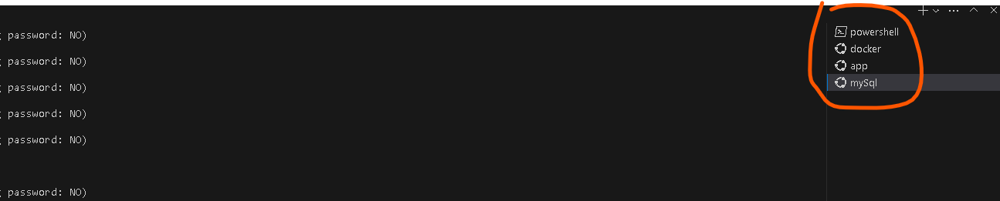

# 概要
initial commit
dockerの設定、利用方法など

以下のリンクから拝借

https://github.com/E-handson/docker-laravel

## セットアップ
```bash
# コンテナを作成する
＃ docker-compose build

# コンテナを表示する
NAME                        IMAGE                     COMMAND                  SERVICE             CREATED             STATUS              PORTS     
edomaru-laravel6-qa-app-1   edomaru-laravel6-qa-app   "docker-php-entrypoi…"   app                 47 minutes ago      Up 47 minutes       9000/tcp  
edomaru-laravel6-qa-db-1    edomaru-laravel6-qa-db    "docker-entrypoint.s…"   db                  47 minutes ago      Up 47 minutes       3306/tcp, 
33060/tcp
edomaru-laravel6-qa-web-1   nginx:1.18-alpine         "/docker-entrypoint.…"   web                 47 minutes ago      Up 47 minutes       0.0.0.0:8000->80/tcp
```


## laravelに入る
```bash
# appのコンテナに入る
＃docker-compose exec app bash

# localhost:8000が開くことを確認
:/workspace# php artisan serve

# mysqlと接続できることを確認
# migrationテーブルを作成する
:/workspace# php artisan migrate
Migration table created successfully.
Migrating: 2014_10_12_000000_create_users_table
Migrated:  2014_10_12_000000_create_users_table (0.15 seconds)
Migrating: 2014_10_12_100000_create_password_resets_table
Migrated:  2014_10_12_100000_create_password_resets_table (0.08 seconds)
Migrating: 2019_08_19_000000_create_failed_jobs_table
Migrated:  2019_08_19_000000_create_failed_jobs_table (0.04 seconds)

```


## MysSQLに入る

php artisan migrate 
```bash
# mysqlのコンテナに入る
docker-compose exec db bash

# mysqlにrootでログインする passwordはsecret
bash-4.4# mysql -u root -p

# データベースを作成する
mysql> CREATE DATABASE laravel_local;

# データベースが作成されたことを確認する
mysql> SHOW DATABASES
+--------------------+
| Database           |
+--------------------+
| db                 |
| information_schema |
| laravel_local      |
| mysql              |
| performance_schema |
| sys                |
+--------------------+
6 rows in set (0.01 sec)

# laravel_localのテーブルを確認して、migrationsの存在を確認する
mysql> show tables from laravel_local;
+-------------------------+
| Tables_in_laravel_local |
+-------------------------+
| failed_jobs             |
| migrations              |
| password_resets         |
| users                   |
+-------------------------+
4 rows in set (0.00 sec)


```

## 画像

