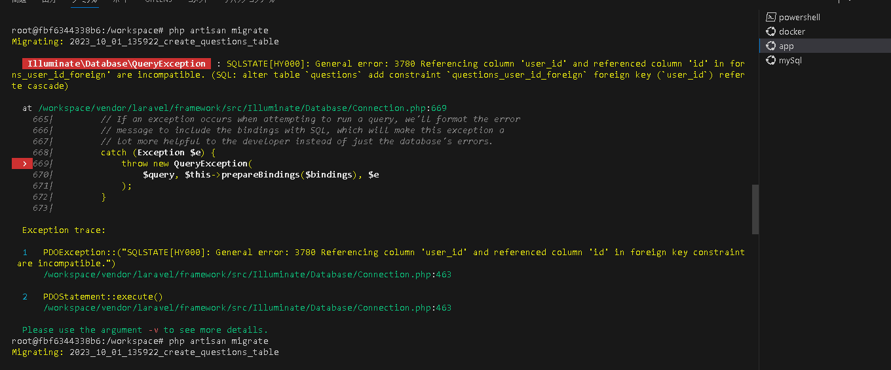
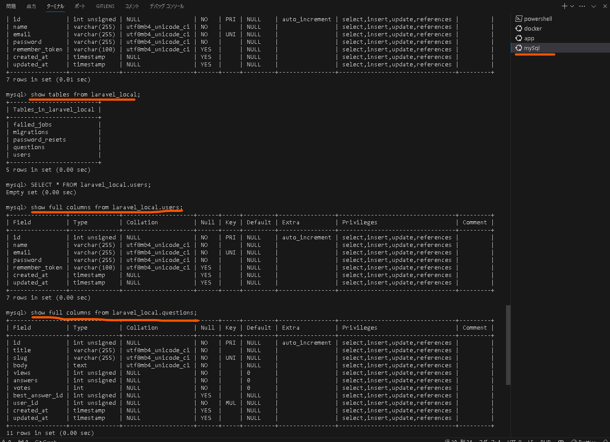

# 概要
Questionのテーブルを作成する。


# WSLの操作

```bash
#以下コマンドを実行すると app/Question.phpとdatabase/migrations/xxxxx_questions_table.phpを作成
:/workspace#php artisan make:model Question --migration 
Model created successfully.
Created Migration: 2023_10_01_135922_create_questions_table

# 以下３つのファイルを編集
# 1.app/Question.php 
# 2.database/migrations/xxxxx_questions_table.php
# 3.app/User.php

# 以下コマンドを実行して、mysqlにQuestionテーブルを作成がエラー発生
:/workspace#php artisan migration
Illuminate\Database\QueryException  : SQLSTATE[HY000]: General error: 3780 Referencing column 'user_id' and referenced column 'id' in foreign key constraint 'questions_user_id_foreign' are incompatible.
#  以下略

# 　
root@fbf6344338b6:/workspace# php artisan migrate:fresh
Dropped all tables successfully.
Migration table created successfully.
Migrating: 2014_10_12_000000_create_users_table
Migrated:  2014_10_12_000000_create_users_table (0.09 seconds)
Migrating: 2014_10_12_100000_create_password_resets_table
Migrated:  2014_10_12_100000_create_password_resets_table (0.08 seconds)
Migrating: 2019_08_19_000000_create_failed_jobs_table
Migrated:  2019_08_19_000000_create_failed_jobs_table (0.05 seconds)
Migrating: 2023_10_01_135922_create_questions_table
Migrated:  2023_10_01_135922_create_questions_table (0.18 seconds)


```

# 画像

php artisan migrationでエラー発生　原因不明
一応テーブルは生成されているが....


```bash
root@fbf6344338b6:/workspace# php artisan migrate  
Migrating: 2023_10_01_135922_create_questions_table

   Illuminate\Database\QueryException  : SQLSTATE[HY000]: General error: 3780 Referencing column 'user_id' and referenced column 'id' in foreign key constraint 'questions_user_id_foreign' are incompatible. (SQL: alter table `questions` add constraint `questions_user_id_foreign` foreign key (`user_id`) references `users` (`id`) on delete cascade)

  at /workspace/vendor/laravel/framework/src/Illuminate/Database/Connection.php:669
    665|         // If an exception occurs when attempting to run a query, we'll format the error
    666|         // message to include the bindings with SQL, which will make this exception a
    667|         // lot more helpful to the developer instead of just the database's errors.
    668|         catch (Exception $e) {
  > 669|             throw new QueryException(
    670|                 $query, $this->prepareBindings($bindings), $e
    671|             );
    672|         }
    673|

  Exception trace:

  1   PDOException::("SQLSTATE[HY000]: General error: 3780 Referencing column 'user_id' and referenced column 'id' in foreign key constraint 'questions_user_id_foreign' are incompatible.")
      /workspace/vendor/laravel/framework/src/Illuminate/Database/Connection.php:463

  2   PDOStatement::execute()
      /workspace/vendor/laravel/framework/src/Illuminate/Database/Connection.php:463

  Please use the argument -v to see more details.

```




mysqlでテーブルが作成されたことを確認

