# 概要
データベースの上questionテーブルにダミーデータを作成する。


# cliでの操作


```bash
# database/factories/QuestionFactoryが生成される
php artisan make:factory QuestionFactory
Factory created successfully.


# QuestionFactory.php User.php Question.php UserFactory.phpを編集する

# tinkerでfakerの機能を試す。
php artisan tinker
> use Faker\Factory;
> $faker = Factory::create();
= Faker\Generator {#5914}

# 簡単な例
> $faker->sentence();
= "Enim doloribus minus totam."

# UserFactoryを実行する
>factory(App\User::class,3)->create()
= Illuminate\Database\Eloquent\Collection {#5946
    all: [
      App\User {#5942
        name: "Dedric Hintz",
        email: "wwaters@example.com",
        #password: "$2y$10$TKh8H1.PfQx37YgCzwiKb.KjNyWgaHb9cbcoQgdIVFlYg7B77UdFm",
        #remember_token: "mjrYf0sykd",
        updated_at: "2023-10-01 21:36:16",
        created_at: "2023-10-01 21:36:16",
        id: 1,
      },
      App\User {#5940
        name: "Mr. Braulio Hartmann",
        email: "terrance04@example.net",
        #password: "$2y$10$TKh8H1.PfQx37YgCzwiKb.KjNyWgaHb9cbcoQgdIVFlYg7B77UdFm",
        #remember_token: "TCcFpsBu3x",
        updated_at: "2023-10-01 21:36:16",
        created_at: "2023-10-01 21:36:16",
        id: 2,
      },
      App\User {#5938
        name: "Juliana Gorczany",
        email: "theresa24@example.net",
        #password: "$2y$10$TKh8H1.PfQx37YgCzwiKb.KjNyWgaHb9cbcoQgdIVFlYg7B77UdFm",
        #remember_token: "1hU2169dFP",
        updated_at: "2023-10-01 21:36:16",
        created_at: "2023-10-01 21:36:16",
        id: 3,
      },
    ],
  }

root@fbf6344338b6:/workspace# php artisan migrate:fresh --seed
Dropped all tables successfully.
Migration table created successfully.
Migrating: 2014_10_12_000000_create_users_table
Migrated:  2014_10_12_000000_create_users_table (0.11 seconds)
Migrating: 2014_10_12_100000_create_password_resets_table
Migrated:  2014_10_12_100000_create_password_resets_table (0.07 seconds)
Migrating: 2019_08_19_000000_create_failed_jobs_table
Migrated:  2019_08_19_000000_create_failed_jobs_table (0.04 seconds)
Migrating: 2023_10_01_135922_create_questions_table
Migrated:  2023_10_01_135922_create_questions_table (0.17 seconds)
Database seeding completed successfully.


```

#
```bash
# mysqlデータベースが作成された確認する

# dbコンテナにはいる
docker-compose exec db bash
mysql -u root -p
// passwordはsecret
Enter password:
Enter


```

# クラス図
書く予定


# 参考

## command


### 


## 文法

### Str::slug()

https://readouble.com/laravel/6.x/ja/helpers.html#method-str-slug

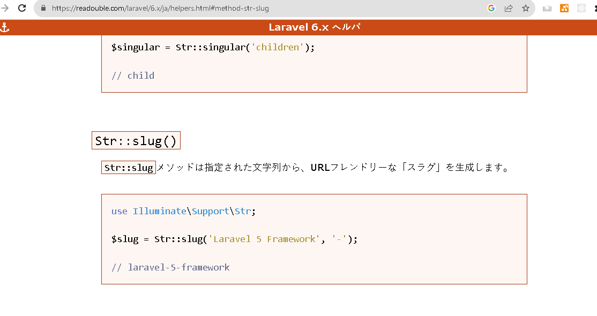

### $faker->sentence()
https://github.com/fzaninotto/Faker

一部抜粋
スクリプト| アウトプット
-----------|----
sentence($nbWords = 6, $variableNbWords = true)  | 'Sit vitae voluptas sint non voluptates.'
paragraphs($nb = 3, $asText = false)|array('Quidem ut sunt et quidem est accusamus aut. Fuga est placeat rerum ut. Enim ex eveniet facere sunt.', 'Aut nam et eum architecto fugit repellendus illo. Qui ex esse veritatis.', 'Possimus omnis aut incidunt sunt. Asperiores incidunt iure sequi cum culpa rem. Rerum exercitationem est rem.')
name($gender = nullaaa｜'male'｜'female')|'Dr. Zane Stroman'


### rand(int $min, int $max):int

https://www.php.net/manual/ja/function.rand.php

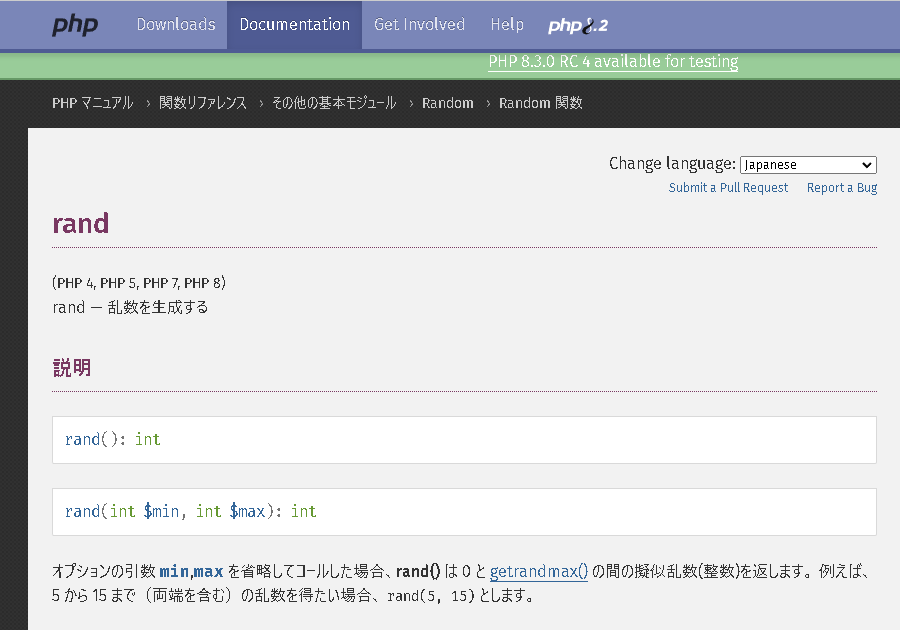


### saveMany

https://readouble.com/laravel/6.x/ja/eloquent-relationships.html

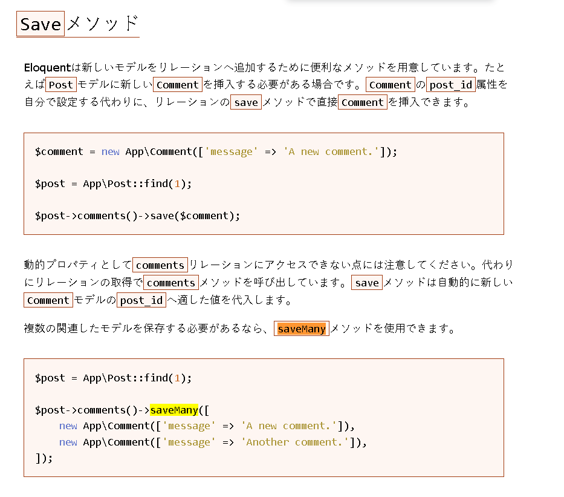

https://laravel.com/api/8.x/Illuminate/Database/Eloquent/Relations/HasMany.html#method_saveMany

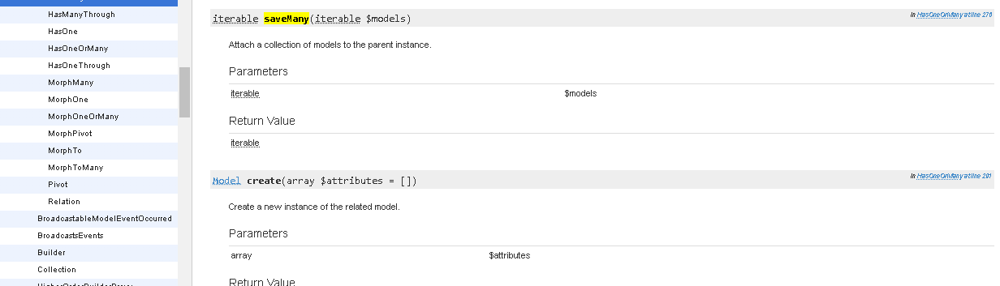


### $factory.make

#### 概要

https://readouble.com/laravel/6.x/ja/database-testing.html

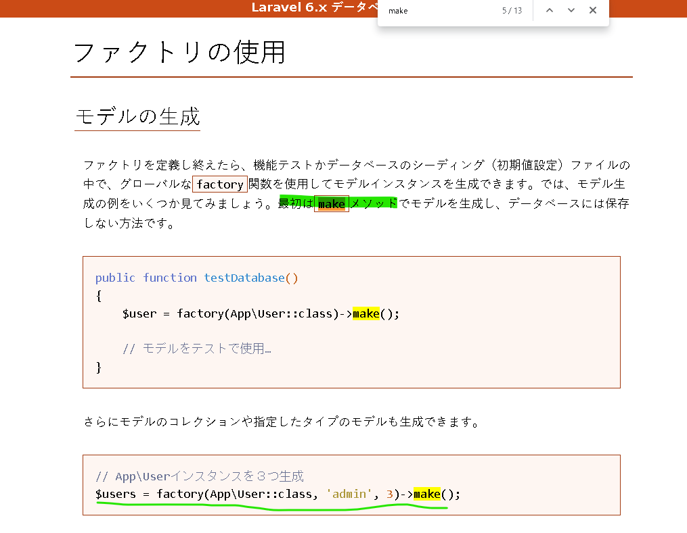

#### api

https://laravel.com/api/6.x/Illuminate/Contracts/Auth/Factory.html

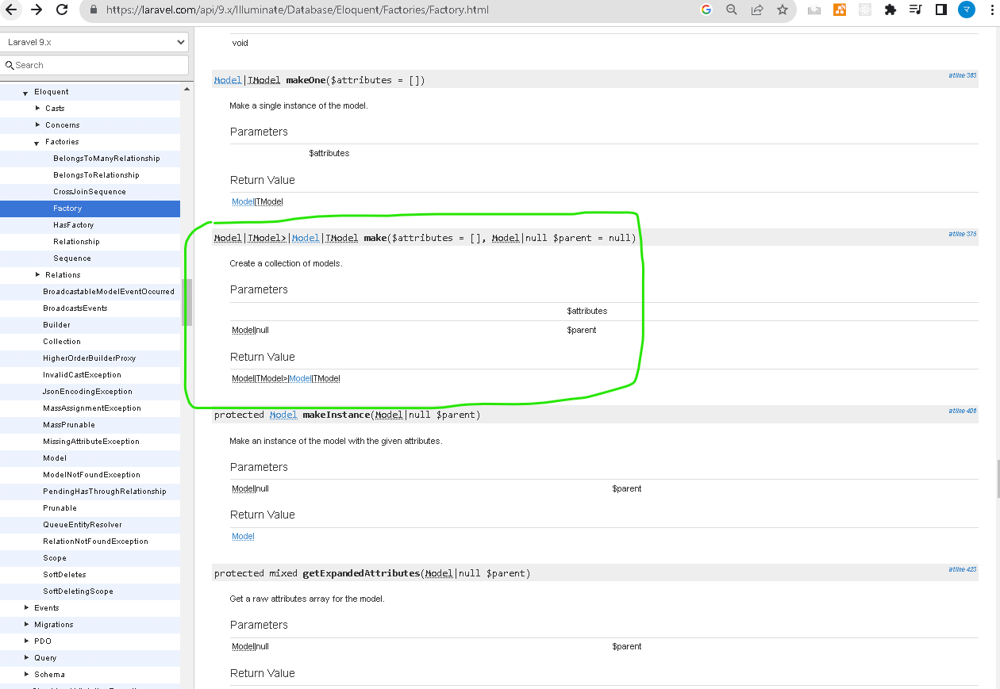

#### ソース

https://github.com/laravel/framework/blob/9.x/src/Illuminate/Database/Eloquent/Factories/Factory.php#L375

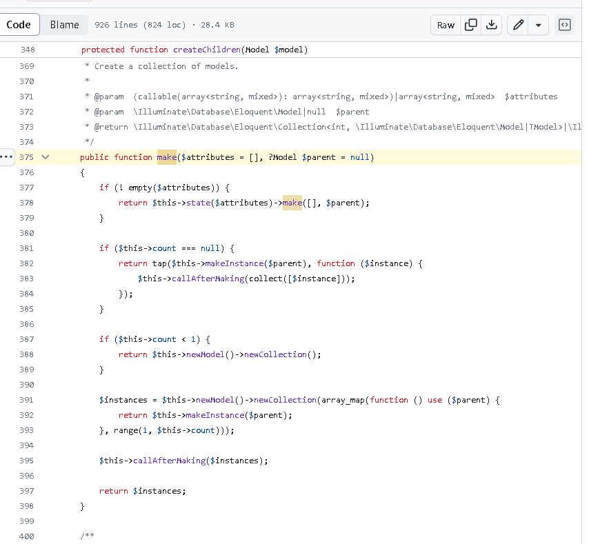

### $factory.define

https://readouble.com/laravel/6.x/ja/database-testing.html

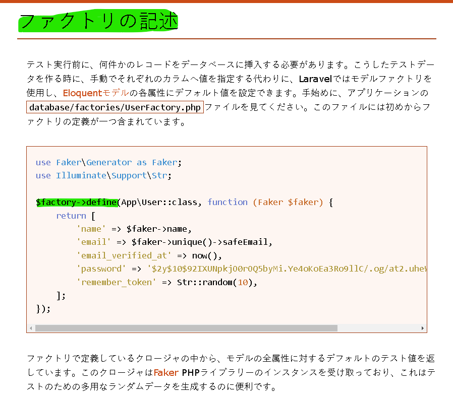

https://laravel.com/api/6.x/Illuminate/Database/Eloquent/Factory.html#method_define

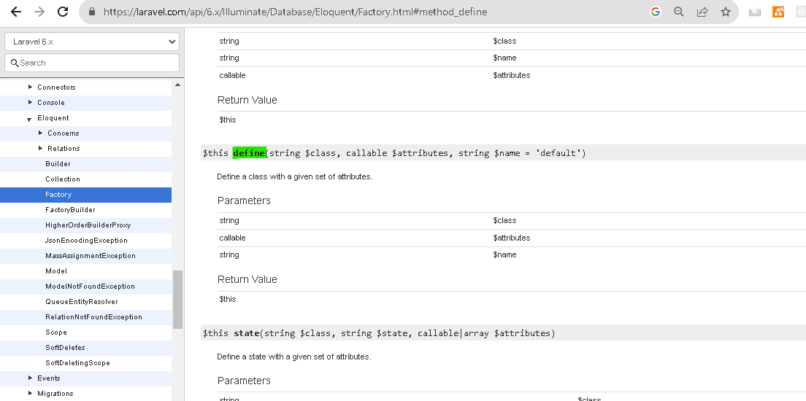

### factory->create()

https://readouble.com/laravel/6.x/ja/database-testing.html?header=%25E3%2583%25A2%25E3%2583%2587%25E3%2583%25AB%25E3%2581%25AE%25E4%25BF%259D%25E5%25AD%2598

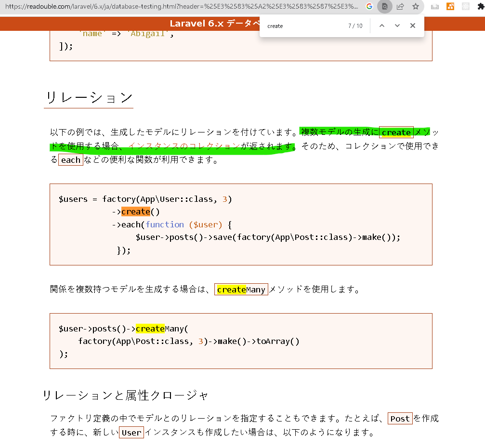


https://laravel.com/api/6.x/Illuminate/Database/Eloquent/Factory.html#method_create


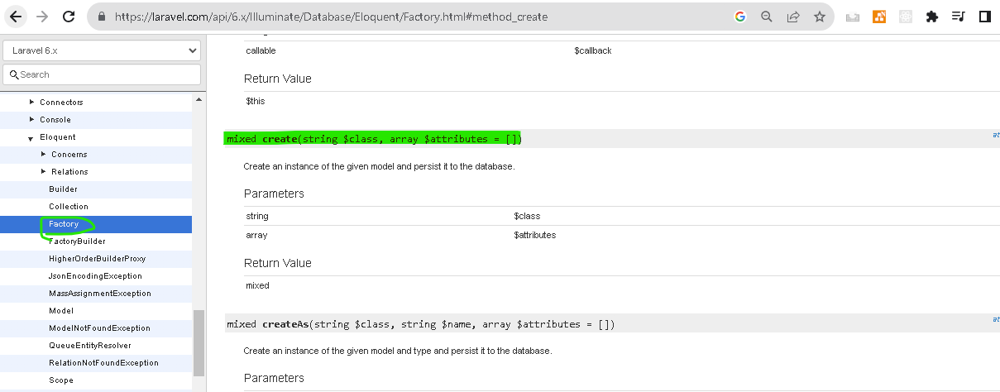
