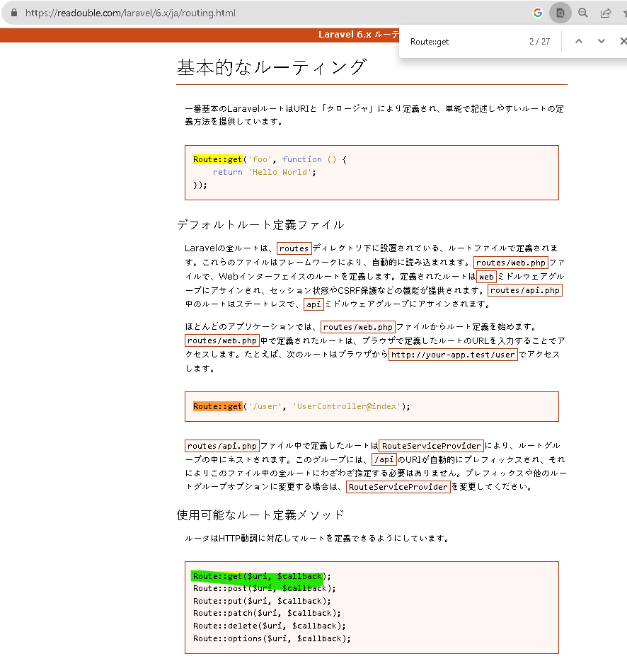

# 概要
コミット分
https://github.com/RYA234/edomaru-laravel6-qa/commit/e16ade20cc0ce8fe30cb946c57aef1f083ea42a1#diff-efc62f9b59c92d227f035b799c8bb0a6e66132a61fe9e85bc96c5635d733ab83

Controllerと routes/web.phpを作成する。
→MVCのVC部分を作成する

Controllerの役割
ルーティングファイル（web.php）などにメソッドを記述していくとファイル長が膨大になってしまうため、コントローラーを使用することで、メソッドを利用しやすくなる。

web.php
ルーティングの機能
URLと,Controllerのmethodを繋げる

# CLI上での操作

```bash

# QuestionControllerを作成
root@fbf6344338b6:/workspace# php artisan make:controller QuestionsController --resource --model=Questions

 A App\Questions model does not exist. Do you want to generate it? (yes/no) [yes]:
 > y

Model created successfully.
Controller created successfully.

# QuestionsController web.php を編集

#
php artisan vendor:publish --tag=laravel-pagination

#サーバーを開いて http://127.0.0.1:8000/questions?page=1に移動する
php artisan serve
```

# 発生したエラー
## http://127.0.0.1:8000/questions?page=1 にアクセスすると Route[login] note defined
### 症状
http://127.0.0.1:8000/questions?page=1 にアクセスすると 
Route[login] note definedというエラーメッセージが出る。画像参照


### 原因
route::listにloginが無いため。


### 対処方法
web.phpに
Auth::routes();
を追加する。


## フロントエンドでCSSが反映されていない？
### 症状

### 原因
laravelのバージョンが違うため

### 対処方法 まだ未解決

118. Download this New Laravel Versions Reference Guide
の添付ファイルのsession1を参考にする


https://www.udemy.com/course/laravel-vuejs-fullstack-web-development/learn/lecture/14850098#questions/8603952


# 参考

## command

### php artisan make:controller XXXXXController --resource --model=Questions
標準でCRUDルートのコントローラを作成

https://readouble.com/laravel/6.x/ja/controllers.html


### php artisan vendor:publish --tag=XXXXXXXX

https://readouble.com/laravel/6.x/ja/packages.html


## 文法

### Auth::route()

https://senooken.jp/post/2020/04/15/4012/#20200316T2343_%E7%B5%90%E8%AB%96

### Route::resource()

https://readouble.com/laravel/6.x/ja/controllers.html


https://laravel.com/api/6.x/Illuminate/Support/Facades/Route.html#method_resource


### Route::get()->name()
https://readouble.com/laravel/6.x/ja/routing.html



名前付きルート
https://readouble.com/laravel/6.x/ja/routing.html


https://laravel.com/api/6.x/Illuminate/Support/Facades/Route.html#method_get


### $this->middleware()

https://readouble.com/laravel/6.x/ja/middleware.html


https://laravel.com/api/6.x/Illuminate/Routing/Controller.html#method_middleware


### return view(string $url, string $view, array $data = [])

ビュールート

https://readouble.com/laravel/6.x/ja/routing.html


https://laravel.com/api/6.x/Illuminate/Support/Facades/Route.html#method_view


### function __construct(){}
php コンストラクタ

https://www.php.net/manual/ja/language.oop5.decon.php


### @extends　@section ~ @endsection 　　レイアウト拡張

https://readouble.com/laravel/6.x/ja/blade.html


### @foreach ~ @endforeach

https://readouble.com/laravel/6.x/ja/blade.html


