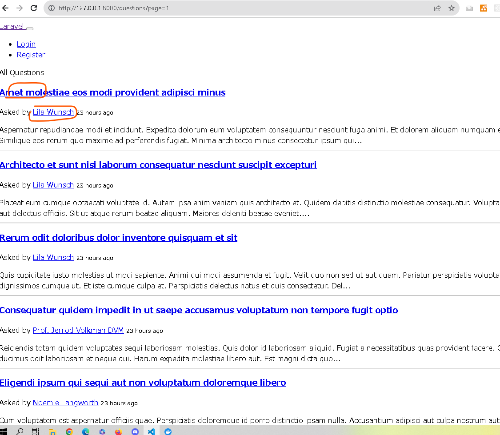

# 概要


# cli上の処理

```bash
# composer.jsonに追加して以下コマンドを実行
:/workspace# composer install

# ファイルを編集する

# tinkerを使って関数の動きを確認する
:/workspace# php artisan tinker
> $q = App\Question::first()
= App\Question {#6899
    id: 1,
    title: "Amet molestiae eos modi provident adipisci minus",
    slug: "amet-molestiae-eos-modi-provident-adipisci-minus",
    body: """
      Aspernatur repudiandae modi et incidunt. Expedita dolorum eum voluptatem consequuntur nesciunt fuga animi. Et dolorem aliquam numquam et et adipisci. Similique eos rerum quo maxime ad perferendis fugiat.\n
      \n
      Minima architecto minus consectetur ipsum quis ut quod. At a amet ea enim quia quos. Odit veniam vero delectus vero sed. Eum voluptatem vel fugit aperiam exercitationem deserunt nam nobis.\n
      \n
      Itaque laborum minus dignissimos omnis quae voluptate. Eligendi nihil optio porro explicabo cum delectus. Provident inventore quo et delectus incidunt voluptatum. Dolores explicabo nemo aut natus odio quibusdam quaerat delectus.\n
      \n
      Modi quas ipsa quae fuga sunt tenetur assumenda. Quia quaerat voluptate sint esse quo. Aut tempora rerum illum et aut laboriosam voluptatibus.
      """,
    views: 4,
    answers: 3,
    votes: 5,
    best_answer_id: null,
    user_id: 1,
    created_at: "2023-10-01 22:22:13",
    updated_at: "2023-10-01 22:22:13",
  }

> $q->created_at->diffForHumans();
= "22 hours ago"

> created_at->format("d/m/Y")

   ParseError  syntax error, unexpected '->' (T_OBJECT_OPERATOR), expecting ';'.

> $q->created_at->format("d/m/Y")
= "01/10/2023"

#  下を開く
# http://127.0.0.1:8000/questions?page=1
```


画像



# 参考
laravel debugger
https://github.com/barryvdh/laravel-debugbar

## 文法

### Str::limit()

https://readouble.com/laravel/8.x/ja/helpers.html#method-str-limit


