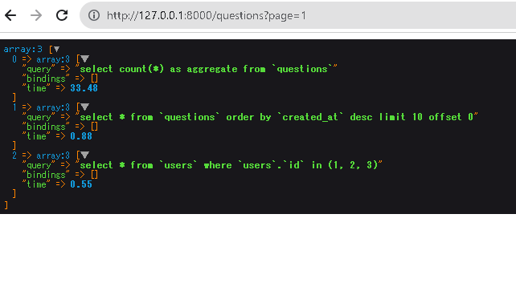

# 概要
enableQueryLogを使ってSQLを確認する

# やること
```diff:
<!-- QuestionController.php -->
    public function index()
    {
+        \DB::enableQueryLog();
        $questions = Question::with('user')->latest()->paginate(10);
+        dd(\DB::getQueryLog());
        return view('questions.index',compact('questions'));

    }

```

\DB::enableQueryLog();
と
dd(\DB::getQueryLog());の間にクエリを挟む
http://127.0.0.1:8000/questions
を開く
結果
実行されているSQLを確認できる




# 参考

https://loglog.xyz/programming/enablequerylog