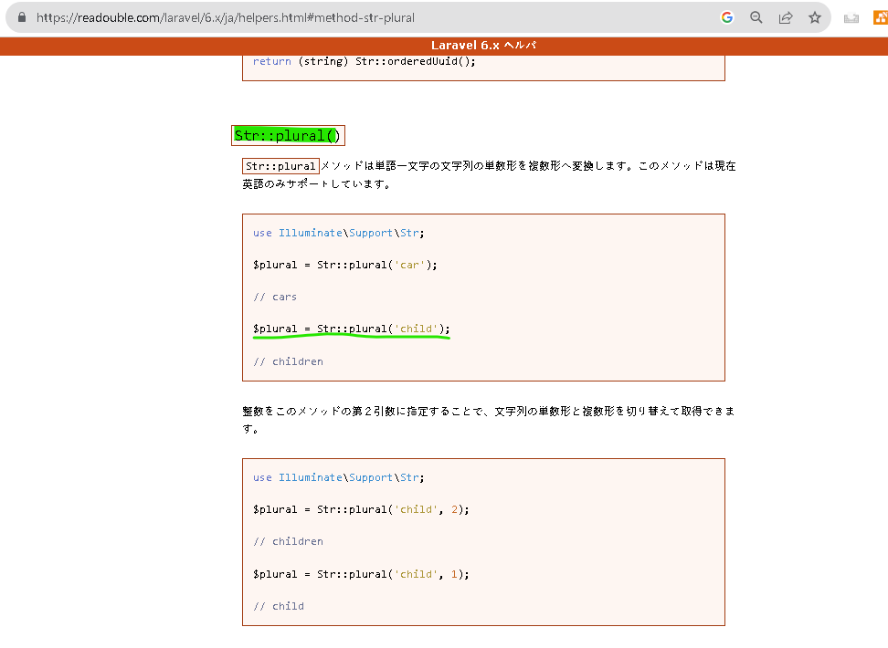
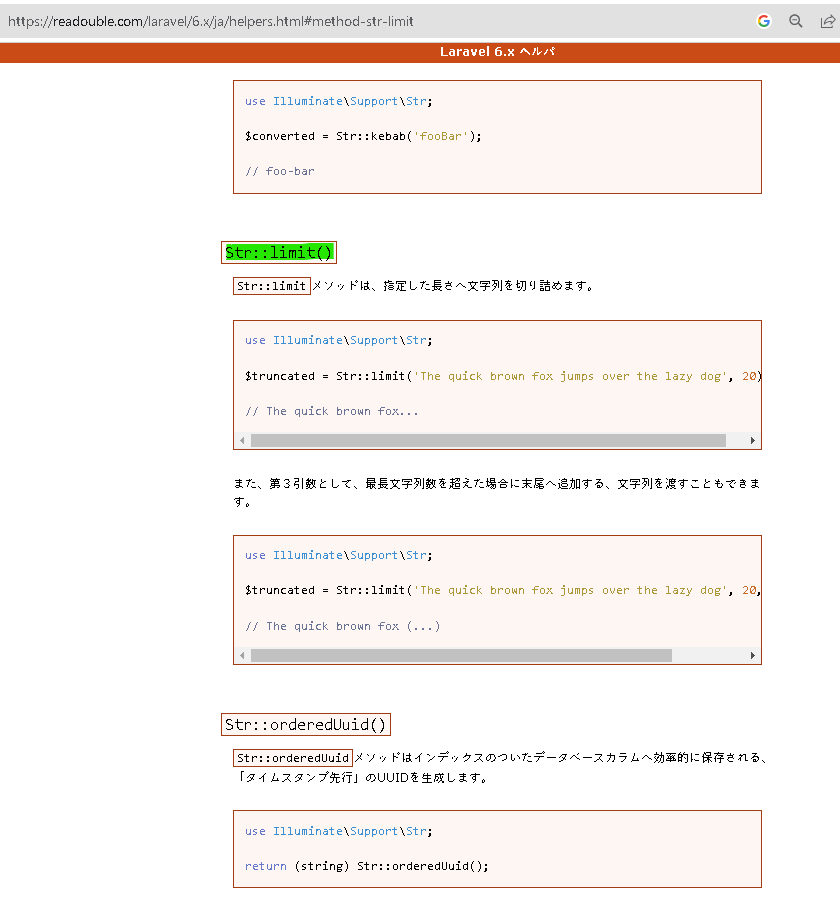
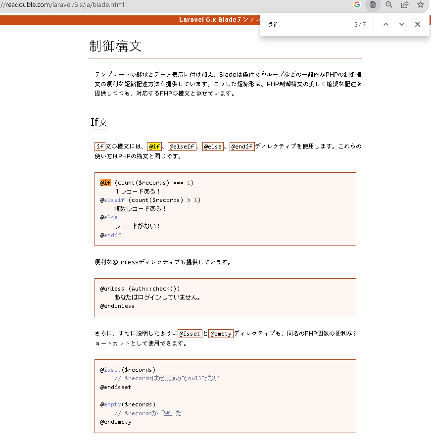
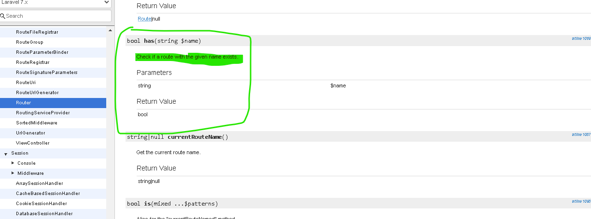

# 概要
質問のタイトルとvote数をブラウザ上で表示するようにする

commit分

https://github.com/RYA234/edomaru-laravel6-qa/commit/e4852de4bdf2bb064996ce7194ec8cde5d25a3cc

# CLI上での操作
無し
CSS反映は未だ

# 参考

## Str::plural
単数形から複数形にする

https://readouble.com/laravel/6.x/ja/helpers.html#method-str-plural

## Str::limit
文字を切り詰める関数

https://readouble.com/laravel/6.x/ja/helpers.html#method-str-limit

## @if ~ @endif

https://readouble.com/laravel/6.x/ja/blade.html

## Route::has('')

https://laravel.com/api/7.x/Illuminate/Routing/Router.html#method_has

