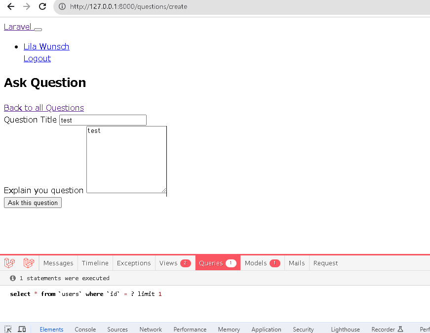
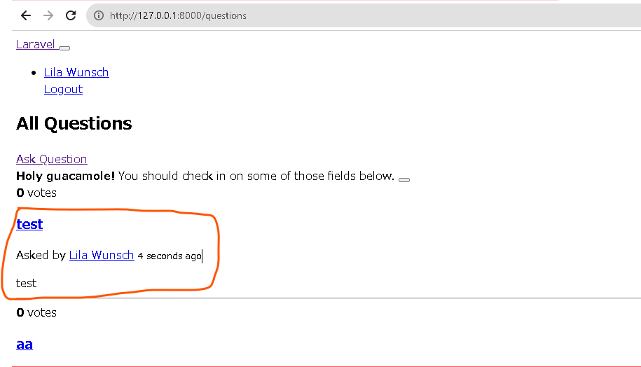

# 概要
以下２点を追加する
追加する質問の内容のバリデーション（予めログインの必要がある）
DBに保存する。
# CLI上の操作

```bash
 php artisan make:request AskQuestionRequest
```

# ブラウザ上での操作

## ログインする
以下URLにアクセスしログインする。

ユーザー名：jessie88@example.net
パスワード：secret

## 質問投稿する
以下リンクにアクセスする
http://127.0.0.1:8000/questions/create

titleとbodyに適当な文字を入力して、[Ask this questiuon]をクリック


## 投稿されたことを確認する
http://127.0.0.1:8000/questions にリダイレクトする


