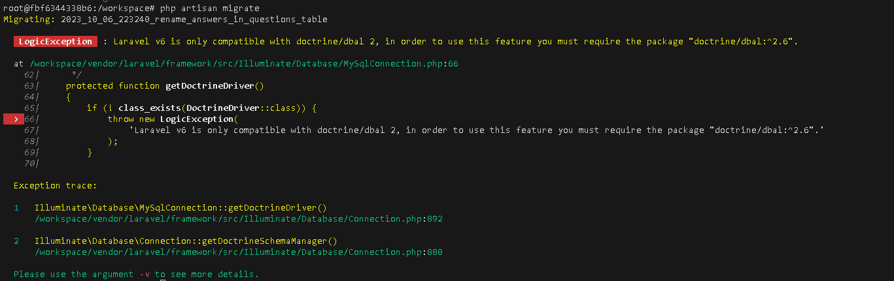

# 概要
Answerのテーブルを作成する

# CLI上の操作

```bash

# Answer.phpとマイグレーションファイルを作成する
php artisan make:model Answer -m


# rename_answers_in_questions_table.phpを作成する
php artisan make:migration rename_answers_in_questions_table --table=questions

# mysql側に反映する
php artisan migrate

```

mysql 側の操作
```bash
# mysqlのコンテナに入る
 docker-compose exec db bash

#passwordはsecret 
mysql -u root -p
# answerが作成されたことを確認
mysql> show tables from laravel_local;
+-------------------------+
| Tables_in_laravel_local |
+-------------------------+
| answers                 |
| failed_jobs             |
| migrations              |
| password_resets         |
| questions               |
| users                   |
+-------------------------+

# answerのカラム情報を確認する
mysql> SHOW COLUMNS FROM laravel_local.answers;
+-------------+--------------+------+-----+---------+----------------+
| Field       | Type         | Null | Key | Default | Extra          |
+-------------+--------------+------+-----+---------+----------------+
| id          | int unsigned | NO   | PRI | NULL    | auto_increment |
| question_id | int unsigned | NO   |     | NULL    |                |
| user_id     | int unsigned | NO   |     | NULL    |                |
| body        | text         | NO   |     | NULL    |                |
| votes_count | int          | NO   |     | 0       |                |
| created_at  | timestamp    | YES  |     | NULL    |                |
| updated_at  | timestamp    | YES  |     | NULL    |                |
+-------------+--------------+------+-----+---------+----------------+

# questionsのカラムを情報を確認し、answer_countに変更されていることを確認する
mysql> SHOW COLUMNS FROM laravel_local.questions;
+----------------+--------------+------+-----+---------+----------------+
| Field          | Type         | Null | Key | Default | Extra          |
+----------------+--------------+------+-----+---------+----------------+
| id             | int unsigned | NO   | PRI | NULL    | auto_increment |
| title          | varchar(255) | NO   |     | NULL    |                |
| slug           | varchar(255) | NO   | UNI | NULL    |                |
| body           | text         | NO   |     | NULL    |                |
| views          | int unsigned | NO   |     | 0       |                |
| answers_count  | int unsigned | NO   |     | 0       |                |
| votes          | int          | NO   |     | 0       |                |
| best_answer_id | int unsigned | YES  |     | NULL    |                |
| user_id        | int unsigned | NO   | MUL | NULL    |                |
| created_at     | timestamp    | YES  |     | NULL    |                |
| updated_at     | timestamp    | YES  |     | NULL    |                |
+----------------+--------------+------+-----+---------+----------------+
11 rows in set (0.00 sec)

```

# 発生したエラー

## 1
### 症状
php artisan migrate を実行したところ、rename_answer_in_questions_tableでエラーになる。




### 対処方法
```bash
# doctrine/dbal:^2.6をcomposerでインストールする。
composer require "doctrine/dbal:^2.6"
```
